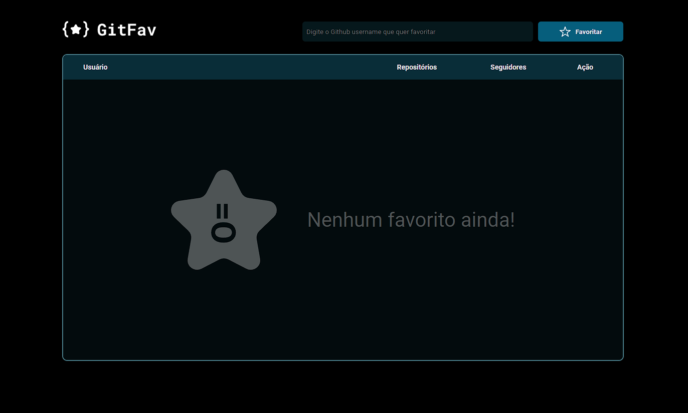

# Github Favorites 2.0
 

> Explorer Desafio Stage 6

Projeto feito utilizando os conceitos de HTML, CSS e JavaScript para criar uma página que possui o intuito de salvar e armazenar no localStorage os usuários da plataforma Github. Projeto feito através do curso da RocketSeat "Explorer".

## [🔗 Clique aqui para acessar o projeto](https://loren175.github.io/github-favs)

#

## 🚀 Tecnologias

- HTML
- CSS
- JavaScript
- Git e Github

## 📞 Contato

>rafael.loren175@gmail.com

>+55 (11) 99959-9140

## 👾 Discord

>rafas#7622